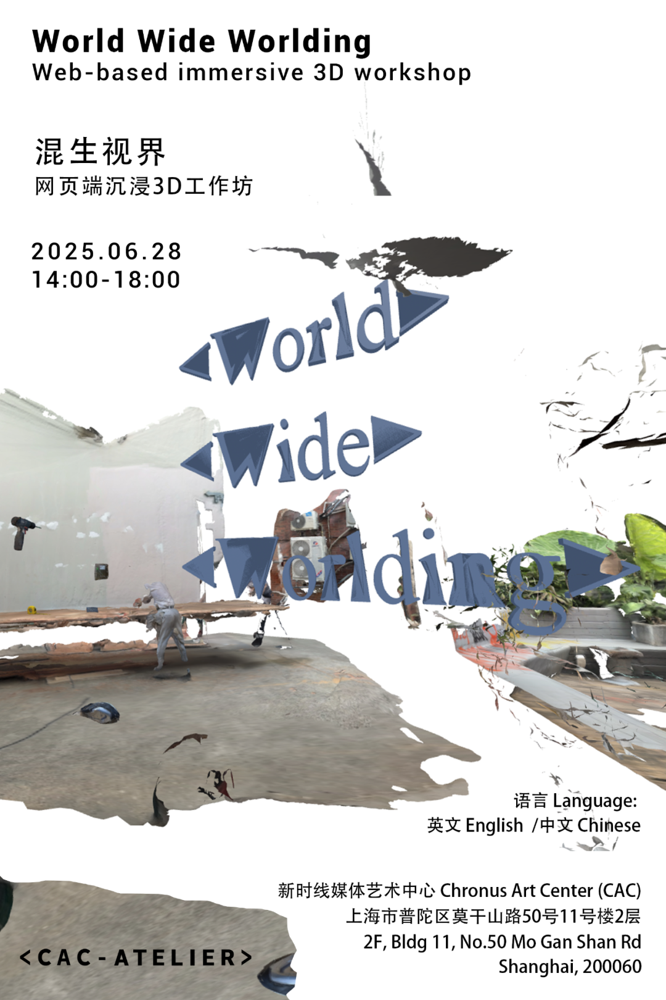

Repository for the CAC Atelier World Wide Worlding workshop held at Chronus Art Center in Shanghai at June 28 2025.

# Repo Structure

| [root]  
|── Gallery - Contains a html template for viewing participants works, note this page relies on Glitch.com, so will stop working Juli 8th 2025  
&emsp;|── index.html  
|── Works - Folder containing back ups of participants source code and assets  
&emsp;|── Participant  
&emsp;&emsp;|── assets  
&emsp;&emsp;|── index.html  
| poster.png - The event poster  
| LICENSE  
| README.md - This file  

# Workshop Description

[EN] “Worlding” is not merely a technique for constructing space—it is a practice of sensing, relating, and opening up new possibilities for reality. Emerging from feminist and posthuman media theory, worlding suggests that the world is not pre-given, but continually generated through perception, collaboration, and mediation.The browser, then, is not just an interface—but a site of emergence. It is where stray light, ambient noise, and overlooked textures can become materials for new world-building. Here, sensing becomes composing.In this workshop, participants will use smartphones and laptops to sample sounds and visuals from their own surroundings, and collaboratively construct an immersive, browser-based 3D environment using tools like A-Frame and Three.js.And perhaps, in the process, you might hear a cricket in your browser. It’s not an error—it’s the real, tapping at the edge of the virtual..As bodies, environments, and digital logics entangle, a collectively sensed and collectively generated world quietly takes form.

[CN] “Worlding”（生成世界）并非单纯的空间建构技术，而是一种关于感知、关系与现实可能性的实践方法。该概念源于女性主义与后人类媒介理论，强调：“世界”不是预设完成的整体，而是在每一次感知、协作与再现中持续生成的过程。在这个意义上，浏览器不仅是一个界面，更是一处世界的发生场——一个可被编码、感知、上传与共建的感知环境。在这样的数字空间中，日常的细节——墙角的阴影、窗外的风声，甚至是一段无意义的杂音——都可能成为构成“世界”的起点。本次工作坊将引导参与者利用手机与电脑，从自身所在环境中采集图像与声音，并通过网页端工具（A-Frame / Three.js），共同搭建一个混生的、沉浸式的3D世界。也许，在这个过程中，你会在浏览器的深处“听见”一只蟋蟀的声音——它不是bug，也不是幻觉，而是现实的一次轻轻敲门。当身体、环境与数字逻辑交织，一个由“混生数据”构成的世界，便悄然浮现。

# More info

